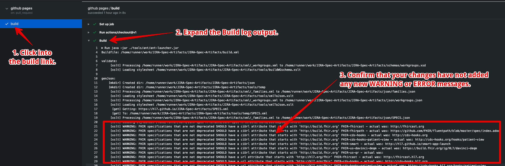

# JIRA-Spec-Artifacts
This project manages the artifacts, pages, and other lists associated with all HL7 projects managed through JIRA feedback projects.

Read more about it here: <https://confluence.hl7.org/display/HL7/Configuring+Specification+Feedback>

To make pull requests against this project, create a fork in your personal Github space and submit a pull request from there.  (Most users will not have permission to create branches directly within this project.)

Source content is found in the `xml` folder:
* [`xml/_workgroups.xml`](xml/_workgroups.xml) - maintains the lists of all work groups that can take responsibility for JIRA feedback items.
* [`xml/_families.xml`](xml/_families.xml) - maintains the list of product families.
    * Note: The 'key' attribute must match the JIRA project prefix for that family.
* `xml/SPECS_???.xml` - lists what specifications are part of a product family.
    * This file should only be edited by the product director responsible the family.
    * The `???` portion of the filename must match one of the keys specified in [`xml/_families.xml`](xml/_families.xml) - and one of these files MUST exist for each family!
* The remaining files (e.g. [`xml/FHIR-core.xml`](xml/FHIR-core.xml)) document the artifacts and pages associated with each specification.
    * The filenames have the format `[family key]-[specification-key].xml`.
    * These files should be maintained in a manner consistent with the artifacts and pages defined in the specification.
    * For some specifications, alignment will be checked as part of the specification publication process.
    * Specification files are maintained independently (rather than as part of the SPECS files) to allow independent maintenance.

Each type of XML file has a corresponding schema in the [`schemas`](schemas) folder.  The [`xml/_workgroups.xml`](xml/_workgroups.xml) file is also converted to a schema to aid validation.

The json files used by the [Jira Elements Connect (formerly nFeed) plugin](https://marketplace.atlassian.com/apps/23337/elements-connect-formerly-nfeed) to manage dropdowns are auto-generated into the json folder.
There is one file for each product family plus a single "combined" file that covers all specifications and is used by the ballot projects
None of these files should be manipulated directly as they'll be overwritten.
An additional file called [`tools/SPECS.xml`](tools/SPECS.xml) is used to help ensure that keys aren't accidentally deleted or changed.

NOTE: any key used by any Jira tracker items must NEVER be removed or changed.  Removal of other keys should be handled by an administrator.

## Adding a New Spec Artifact

When building a new IG, you may encounter a `warning` in your `qa.html` that looks like this:
```
The jira specification file appears to be out of date with the versions, artifacts and pages 
currently defined in the IG.  A proposed revised file to be reviewed and, if appropriate, 
submitted as a pull request against the XML folder in https://github.com/HL7/JIRA-Spec-Artifacts.
```

To address this, you must make sure that:
* You have an entry defined in the proper `xml/SPECS-???.xml` file.
    * For example, if you are adding the `foo` spec to `FHIR`, you would add an entry in the [`xml/SPECS-FHIR.xml`](xml/SPECS-FHIR.xml) file that looked like this:
        ```xml
        <specification key="foo" name="The Foo FHIR Project"/>
        ```
* Your spec file appears in the [`xml`](xml) folder.
    * For example, if you are adding the `foo` FHIR spec, you would create `xml/FHIR-foo.xml` and populate it with something like this:
        ```xml
        <?xml version="1.0" encoding="UTF-8"?>
        <specification
            gitUrl="https://github.com/HL7/foo"
            url="http://hl7.org/fhir/foo"
            ciUrl="http://build.fhir.org/ig/HL7/foo"
            defaultWorkgroup="fhir-i"
            defaultVersion="1.0.0"
            xmlns:xsi="http://www.w3.org/2001/XMLSchema-instance"
            xsi:noNamespaceSchemaLocation="../schemas/specification.xsd"
        >
          <version code="1.0"/>
          <artifactPageExtension value="-definitions"/>
          <artifactPageExtension value="-examples"/>
          <artifactPageExtension value="-mappings"/>
          <artifact name="Example" key="Foo-example" id="Foo/example"/>
          <page name="(NA)" key="NA"/>
          <page name="(many)" key="many"/>
          <page name="Table of Contents" key="toc"/>
          <page name="Home" key="index"/>
          <page name="Artifacts Summary" key="artifacts"/>
          <page name="(profiles)" key="profiles" deprecated="true"/>
          <page name="The Foo FHIR Project" key="foo" url="foo" deprecated="true"/>
        </specification>
        ```

It is recommended that you create a new branch (in this example, you might call it `add-foo`).

Once your files are added to your branch, please also confirm that your new artifacts are not causing any new build errors or warnings.  A workflow will run against you branch for each commit and the output will be available here (update your branch name in the link): <https://github.com/HL7/JIRA-Spec-Artifacts/actions?query=branch%3Aadd-foo>



Finally, when you have built your IG using the publisher locally, it may emit a generated artifact `xml` file for you to add to this repo.  So, if you have that file in your `build` directory, you can add your generated xml to this repo without having to write one manually.

## Building
This JSON artifacts of this project can be built manually on the command line like this:
```sh
bash $> java -jar ./tools/ant/ant-launcher.jar
Buildfile: ~/code/JIRA-Spec-Artifacts/build.xml

validate:
     [xslt] Processing ~/code/JIRA-Spec-Artifacts/xml/_workgroups.xml to ~/code/JIRA-Spec-Artifacts/schemas/workgroups.xsd
     [xslt] Loading stylesheet ~/code/JIRA-Spec-Artifacts/tools/buildWGschema.xslt

genJson:
    [mkdir] Created dir: ~/code/JIRA-Spec-Artifacts/json
    [mkdir] Created dir: ~/code/JIRA-Spec-Artifacts/tools/temp
     [xslt] Processing ~/code/JIRA-Spec-Artifacts/xml/_families.xml to ~/code/JIRA-Spec-Artifacts/json/families.json
     [xslt] Loading stylesheet ~/code/JIRA-Spec-Artifacts/tools/xmlToJson.xslt
     [xslt] Processing ~/code/JIRA-Spec-Artifacts/xml/_workgroups.xml to ~/code/JIRA-Spec-Artifacts/json/workgroups.json
     [xslt] Loading stylesheet ~/code/JIRA-Spec-Artifacts/tools/xmlToJson.xslt
      [get] Getting: https://hl7.github.io/JIRA-Spec-Artifacts/SPECS.xml
      [get] To: ~/code/JIRA-Spec-Artifacts/tools/temp/SPECS.xml
     [xslt] Processing ~/code/JIRA-Spec-Artifacts/xml/_families.xml to ~/code/JIRA-Spec-Artifacts/json/SPECS.json
     [xslt] Loading stylesheet ~/code/JIRA-Spec-Artifacts/tools/buildSpecJSON.xslt

test:

BUILD SUCCESSFUL
Total time: 2 seconds
bash $> 
```

## Automatic Deployments
There is a GitHub Action defined to automatically build and deploy the JSON files from the `master` repo into the `gh-pages` branch upon every commit to the `master` branch.  For this to work, a deployment ssh key has been defined and added to the repository settings.  You must be an admin of the repo to make changes to this key.
